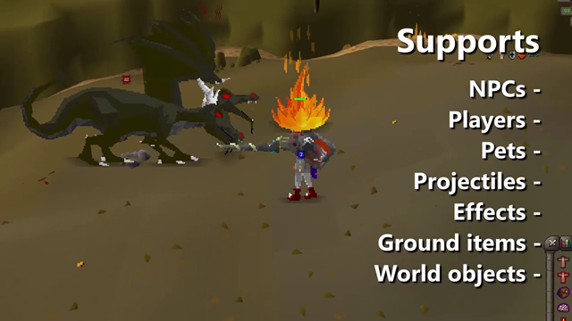
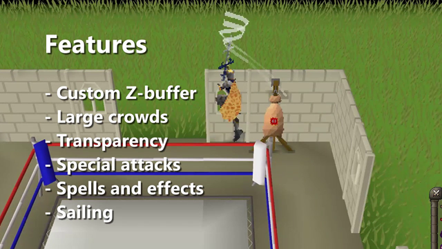
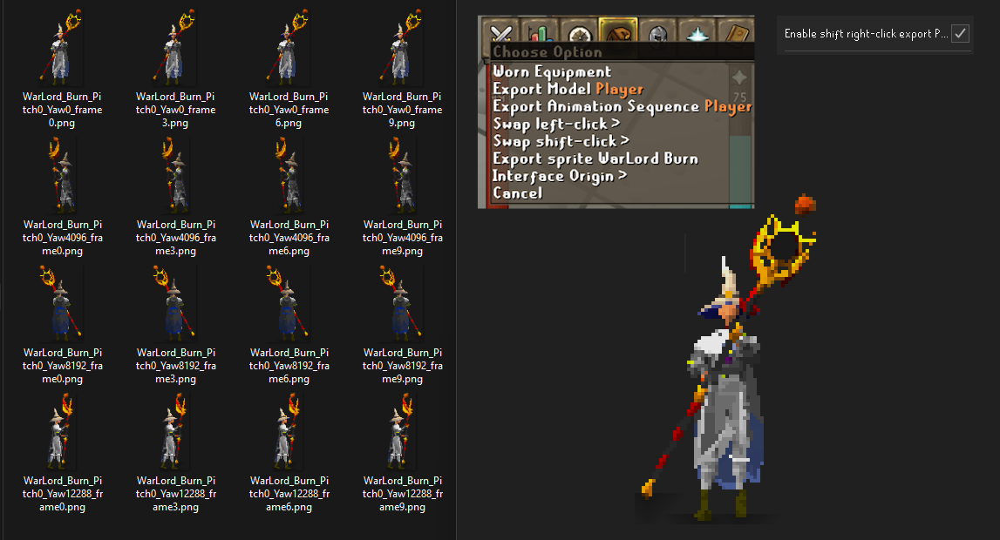

# 2DScape

2DScape is a 3D-to-2D downsampler that tries to show what Old School RuneScape might look like with RSC's graphics. It's all rendered as an overlay, with custom occlusion culling so the sprites actually sit in the world.

**Heads up:** You need RuneLite's **GPU** plugin or **117 HD** enabled for 2DScape to render properly. Without a GPU renderer, it can't hide the original 3D models before drawing the 2D ones over them.

There are a LOT of config options to play with, so have a go and find your favourite style.

- NPCs, Players, Pets and even thralls become Doom-style camera-facing billboards
- Projectiles and effects are also rendered in 2D
- Even Ground items (stuff on the floor) are rendered in 2D, just at a slightly higher angle for visibility
- You can also enable world objects being converted to 2D, it's really stupid

- Custom z-buffer hides sprites behind scenery including transparency composition with transparent geometry like stained glass windows
- Large crowds render well on average hardware, there are config options to reduce how much occlusion culling and how much billboards can update per frame, so you can configure this for a toaster if performance is ever an issue
- Special attacks work too including their graphics
- All Spells work, so yes, the Ice Barrage blocks show up as 2D.
- Sailing partially works, just doesn't work on boat hulls, maybe I'll look into this in the future, crew and Sailing NPCs still render.

Get a skilling XP drop and a little retro bubble pops up above your character, just like in RSC.

Want to make a sprite sheet? Turn on **Enable shift right-click export PNG** in the config, then Shift-right-click a player, NPC, or pet and choose **Export sprite**. Shift-right-click your equipment tab to export yourself. The plugin saves the angles and animation frames as transparent PNGs, ready to put into a 2D sprite sheet for a game lol that'd be so sick if someone used it to make the art for a game.

**Note**: These sprites are generated in real time by rasterizing the triangles from Jagex's Old School RuneScapes in-game models. They aren't hand drawn; they're calculated on the fly with 2D rasterization and a bunch of 3D math. So if you export sprites, keep in mind whatever licensing Jaggy Baggy requiers.

---

## Creator: Kieren Boal

I want to acknowledge and disclose usage of AI agentic engineering in creating this plugin, I have several years industry experience as a programmer, and still hand write code to this day as part of my work life, so it's been amazing being able to transfer the skills I have in programming into a programming domain (Java, specifically with RuneLites Plugin system, learning what the hell a gradel was and how it lol) I was unfailiar with, from this whole process I learnt a HEAP of new skills and how to use the RuneLite API, alongside creating this plugin that I once tried to hand code back in 2022, but was unable to figure out the rendering in Java, I could do the rendering in C# with a CPU rasterizer that I'd written but translating that to Java just wasn't gonna happen easily (I'd even considered writing it in C#, then  hosting a C# server locally that does the rasterization in nice familiar C#, and RuneLite would pipe the models, world and camera position back to the server, but yeah that was absoloutely not gonna fly for a real plugin and would've been really bad lmao), so I've been thrilled to use OpenAI's Codex to make this plugin a reality and actually finish the project! I am very proud of how this has come out.

### Usage of OpenAIs Codex:

- **GPT-5.4:** Original draft code with 2D-to-3D work.
- **GPT-5.5:** First implementation of blocky occlusion culling.
- **GPT-5.6:** Code tidy-up and SO many optimisations. Sol handled orchestration, high-level planning, and a lot of cleanup; Terra and Luna handled implementation.
- **GPT-6.0 Astra:** Made the occlusion culling truly shine by getting rid of the blockiness and adding composite transparency, so sprites can be seen behind transparent geometry like stained glass.
