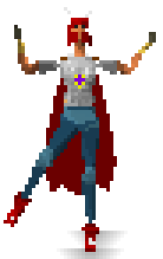
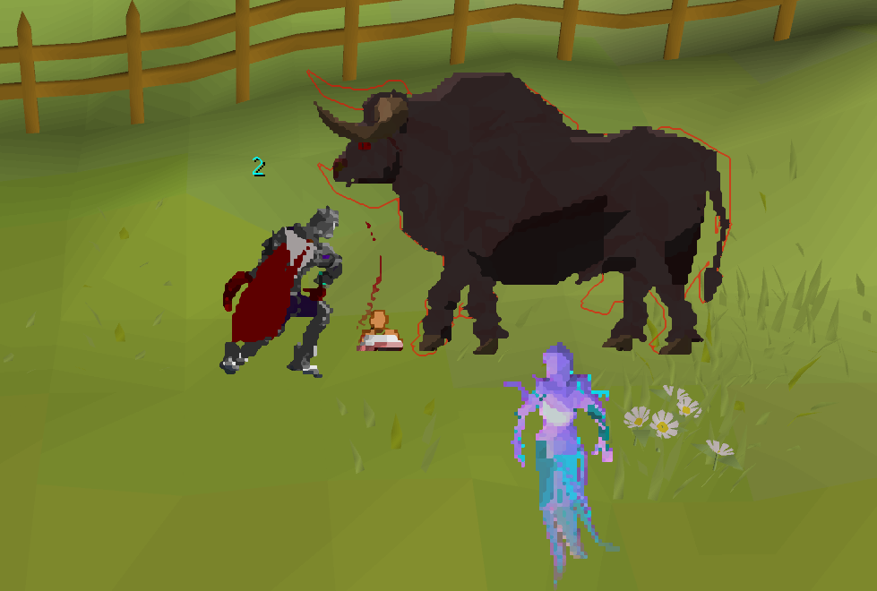
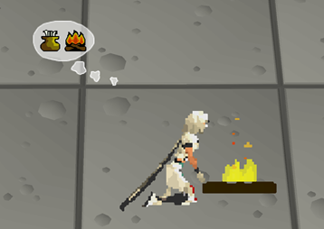
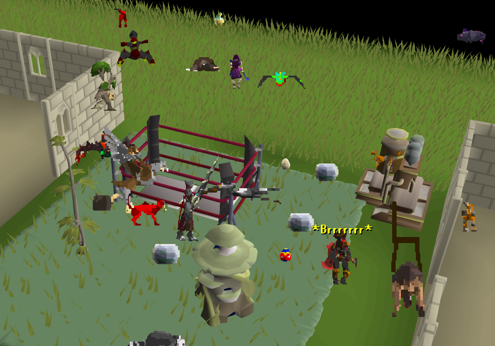
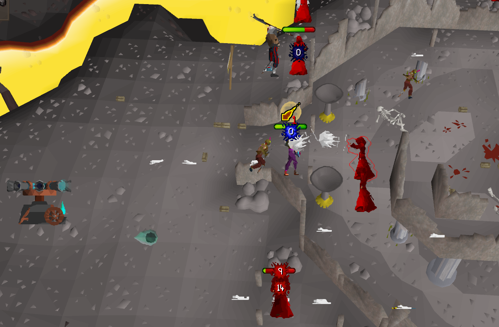
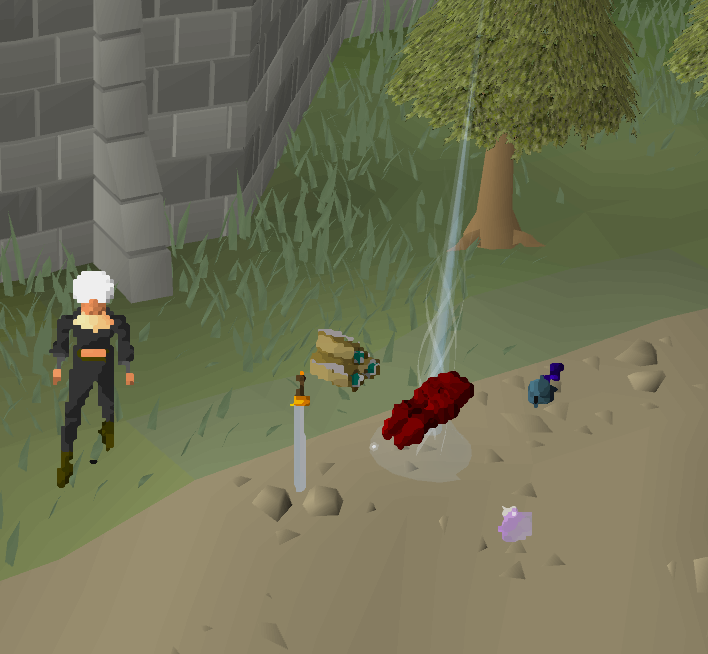
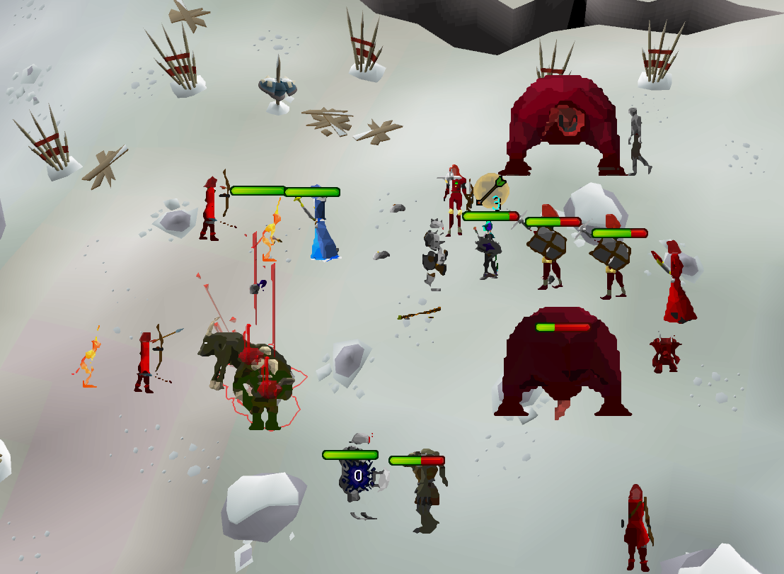
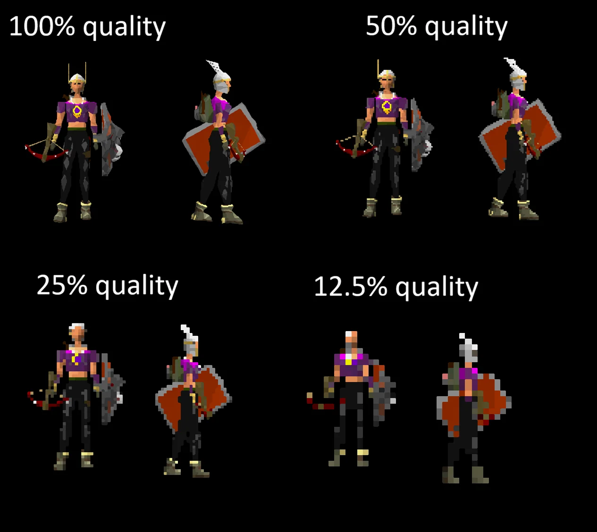
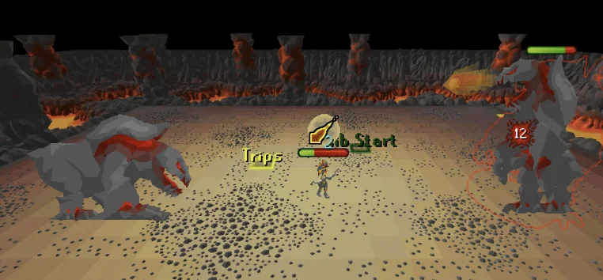

# 2DScape

## A re-imagining of RSC in OSRS


## 2D-facing combat, players, NPCs, thralls, and pets


## 2D skilling, with retro objects and skilling bubbles for XP drops


## 2D pets in a nice retro style


## 2D projectiles too, and yes, that includes the dwarven cannon


## 2D ground items as well


## It actually runs well, even in places like the Wilderness God Wars Dungeon


## Render at different scales, colour palettes, frame rates, and rotations


## It works everywhere, even Jad, even the JalTok-Jad


## About
This plugin is an attempt to recreate the old RuneScape Classic art style inside OSRS by visually replacing NPCs, players, projectiles, pets, ground items, and more with 2D billboard sprites.

It's not trying to be a perfect RSC recreation—the color palettes and art design just don't fit that anymore—but how close and aesthetically pleasing can we get it?

## How It Works
The plugin keeps track of actors, projectiles, tiles, and other renderable bits, then turns them into billboarded 2D sprites that always face the camera.

To sell the look, rotations are snapped into angle buckets and animation frames are intentionally held for a little longer before advancing, which gives everything that lower-frame retro feel instead of looking like smooth modern interpolation.

The other important part is performance. Sprites are only redrawn when something important changes, like rotation, animation state, scale, or invalidated image data. Redraw work is also spread across later frames where possible so it does not all land in one big spike. It is still a goofy CPU-side 2D renderer, but it runs far better than it probably has any right to.

## Standout Toggles
Some of the more fun settings to play with are:

- Render scale, if you want chunkier or cleaner sprites.
- Colour band options, if you want to lean harder into the retro look.
- Frame rate controls, to make animations feel more stiff and old-school or a bit smoother.
- Rotation snapping, which changes how many facing angles things render with; specifically the vertical setting to get vertical frames.
- Skilling bubbles, if you want XP drops to match the rest of the 2D style.

## Requirements

- Java 11
- A RuneLite-compatible Gradle environment
- A RuneLite development client login flow that supports Jagex Accounts

If you are brand new to that last part, it is honestly much less painful than it used to be. There is a proper guide linked below.

## Running Locally
From the plugin root, start the RuneLite development client with:

```powershell
.\gradlew run
```

On Windows, the included helper script does the same thing:

```powershell
.\run.bat
```

If you use a Jagex Account, follow RuneLite's development client login guide:

[Using Jagex Accounts](https://github.com/runelite/runelite/wiki/Using-Jagex-Accounts)

## Building

```powershell
.\gradlew build
```

On Windows, the included helper script runs the build task:

```powershell
.\build.bat
```

## Notes

- This plugin is experimental, intended for local development, and has not been approved by Jagex.
- This project was mostly built agentically. There was still a fair bit of manual tweaking, debugging, and tuning, but most of the code was produced with Codex using ChatGPT 5.4 medium thinking, plus some ChatGPT 5.5 medium on a few especially annoying problems.
- I corrected a lot of logic bugs, pushed a bunch of optimisations, and generally wrestled it into something that was actually viable despite being, at heart, a pretty cursed 2D CPU renderer.
- This has been a very fun project to work on.
- I have wanted to make this plugin for years. I would be comfortable writing something like this in C#, but Java is not a language I have touched seriously in a long time, and this project ended up being a really fun excuse to finally make the thing anyway.
- So yes, this is absolutely one of those "AI helped me bring a dumb idea to life" projects, and I am very happy it exists.
- Feel free to fork it and make changes. If you do, tossing credit my way would be appreciated.
