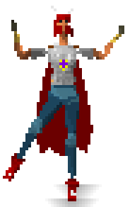
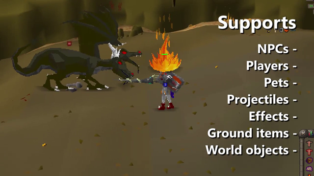
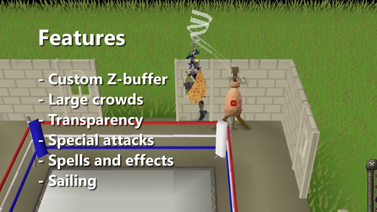
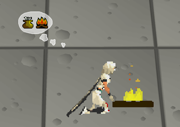
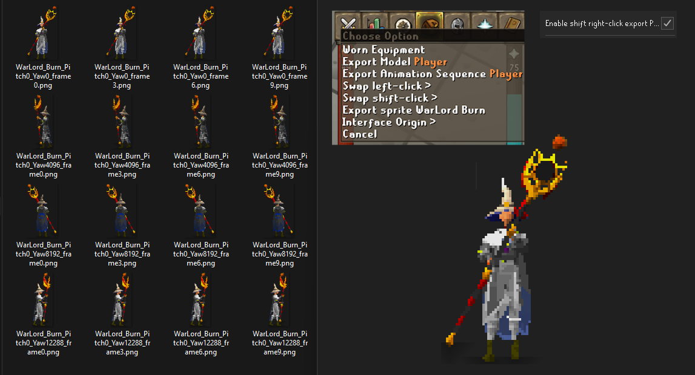

# 2DScape

2DScape is a 3D-to-2D downsampler that tries to show what Old School RuneScape might look like with RSC's graphics. It's all rendered as an overlay, with custom occlusion culling so the sprites actually sit in the world.

**Heads up:** You need RuneLite's **GPU** plugin or **117 HD** enabled for 2DScape to render properly. Without a GPU renderer, it can't hide the original 3D models before drawing the 2D ones over them.

There are a LOT of config options to play with, so have a go and find your favourite style.

## Best experience
If you are doing content that requiers click precision, I'd suggest enabling the following two features:
- "Rendering config" -> "Improved click accuracy mode": this makes the billboards fit the space the NPC actually takes which makes it look more "flat" but for FAR greater click accuracy
- "Retro" -> "Use retro HP bar, overhead chat, hitsplats and prayers": This moves the hitsplats to more accurately represent where they actually are on the sprite; if you enable 'Improved click accuracy mode' you don't really need this; but it does add to the asthetic!

On your first login after an update, 2DScape prints a header such as `2DScape (v1.0.2):`, followed by one `* change` chat line per semicolon-separated entry. Each entry is at most 80 characters, excluding the bullet prefix. Your last seen version is saved per RuneLite configuration profile; a missing or invalid value starts at `1.0.0`, so new users see both `1.0.1` and `1.0.2` once. To add a release, append its semicolon-separated changes to `NpcSnapChangelog` and update `runelite-plugin.properties`; Gradle reads its version from that file. Editing an already-seen release does not replay it.

Under **Limit frame rate**, **Redraw on clickbox resize** lets NPCs and players update their sprite early when their model bounding box or hull width or height changes significantly. It defaults to **50%**; set it to **0%** to disable the check. Resize redraws still respect the per-frame drawing budget.

Animated world-object sprites also follow **Frame rate** when **Limit frame rate** is enabled. RuneLite exposes their current animation frame without a setter, so 2DScape holds each captured sprite until the next update instead of changing the object's native animation frame. This requires world-object sprites to be enabled.

After a resize redraw captures a live pose, normal frame snapping holds that pose until it catches up, avoiding backward jumps. **Show sprite redraws** in Debug displays the reasons inside each redrawn sprite, separated by commas when several changes caused the redraw.

NPC and player sprites use the camera's position relative to each actor to choose their facing angle, with the existing rotation and combat snapping settings still applied. **Ignore camera aware rotation** in Retro restores the previous camera-yaw-only viewing direction; it is unchecked by default. This works independently of **Ignore projection skew correction**. See [camera-aware rotation notes](docs/camera-aware-rotation.md) for the calculation and implementation details.

- NPCs, Players, Pets and even thralls become Doom-style camera-facing billboards
- Projectiles and effects are also rendered in 2D
- Projectile sprites follow the client's current flight position, preserving its arc and launch/impact heights without extra offsets from the animated projectile model.
- Even Ground items (stuff on the floor) are rendered in 2D, just at a slightly higher angle for visibility
- You can also enable world objects being converted to 2D, it's really stupid

- Custom z-buffer hides sprites behind scenery including transparency composition with transparent geometry like stained glass windows
- Large crowds render well on average hardware, there are config options to reduce how much occlusion culling and how much billboards can update per frame, so you can configure this for a toaster if performance is ever an issue
- Special attacks work too including their graphics
- All Spells work, so yes, the Ice Barrage blocks show up as 2D.
- Sailing partially works; boat hulls still use the normal renderer. Crew sprites and effects follow their parent boat's overlap visibility and Entity Hider's boat settings.
- NPC sprites extending below their tile surface are clipped there, so submerged NPCs stay under the water without shifting their sprites.

Get a skilling XP drop and a little retro bubble pops up above your character, just like in RSC. The bubble, icons, and trailing puffs shrink gently with camera zoom, using 1024 as their normal-size reference and retaining about 87% of that size at 512 and 79% at 315.

Want to make a sprite sheet? Turn on **Enable shift right-click export PNG** in the config, then Shift-right-click a player, NPC, pet, or world object and choose **Export sprite**. World objects can be exported even with their billboard setting disabled. Shift-right-click your equipment tab to export yourself. The plugin saves the angles and animation frames as transparent PNGs, ready to put into a 2D sprite sheet for a game lol that'd be so sick if someone used it to make the art for a game.

Exports are saved in RuneLite's `plugin-data/2dscape` directory. The in-game message shows and copies the export folder path.

**Note**: These sprites are generated in real time by rasterizing the triangles from Jagex's Old School RuneScapes in-game models. They aren't hand drawn; they're calculated on the fly with 2D rasterization and a bunch of 3D math. So if you export sprites, keep in mind whatever licensing Jaggy Baggy requiers.

---

## Developer tools

[Retro hitsplat comparisons and maintenance](docs/retro-hitsplats/README.md).

## Creator: Kieren Boal

I want to acknowledge and disclose usage of AI agentic engineering in creating this plugin, I have several years industry experience as a programmer, and still hand write code to this day as part of my work life, so it's been amazing being able to transfer the skills I have in programming into a programming domain (Java, specifically with RuneLites Plugin system, learning what the hell a gradel was and how it lol) I was unfailiar with, from this whole process I learnt a HEAP of new skills and how to use the RuneLite API, alongside creating this plugin that I once tried to hand code back in 2022, but was unable to figure out the rendering in Java, I could do the rendering in C# with a CPU rasterizer that I'd written but translating that to Java just wasn't gonna happen easily (I'd even considered writing it in C#, then  hosting a C# server locally that does the rasterization in nice familiar C#, and RuneLite would pipe the models, world and camera position back to the server, but yeah that was absoloutely not gonna fly for a real plugin and would've been really bad lmao), so I've been thrilled to use OpenAI's Codex to make this plugin a reality and actually finish the project! I am very proud of how this has come out.

### Usage of OpenAIs Codex:

- **GPT-5.4:** Original draft code with 2D-to-3D work.
- **GPT-5.5:** First implementation of blocky occlusion culling.
- **GPT-5.6:** Code tidy-up and SO many optimisations. Sol handled orchestration, high-level planning, and a lot of cleanup; Terra and Luna handled implementation.
- **GPT-6.0 Astra:** Made the occlusion culling truly shine by getting rid of the blockiness and adding composite transparency, so sprites can be seen behind transparent geometry like stained glass.
